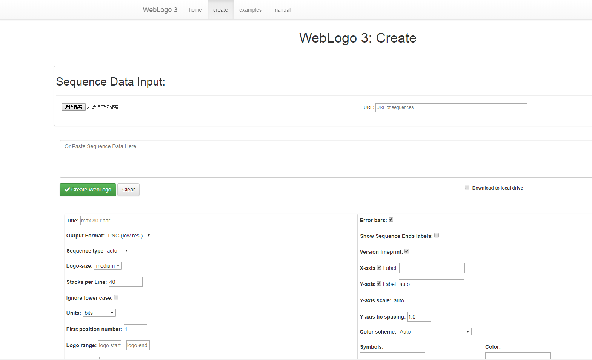
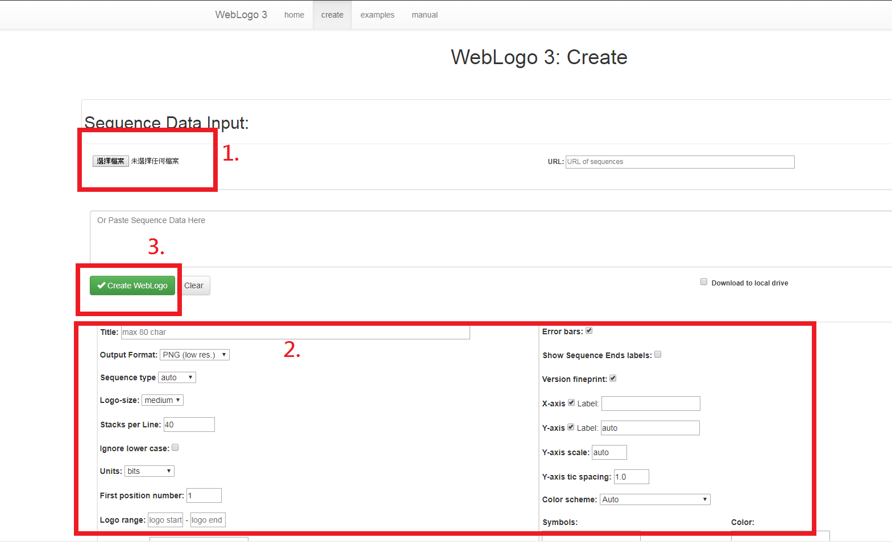
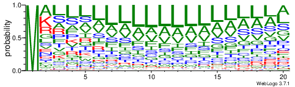

# Sequence LOGO

```
Since the formats from different dataset are different, it need differents script to be done.
```

## Related files
* `parse_signalp_euk.py`
* `parse_signalp_gram-.py`
* `parse_signalp_gram-.-.py`
* `parse_signalp_gram+.py`
* `parse_signalp_gram+.-.py`
* `parse_spds_euk.py`
* `parse_spds_gram-.py`
* `parse_spds_gram-.-.py`
* `parse_spds_gram+.py`
* `parse_spds_gram+.-.py`

### Explanation
* Prefix `parse_` represents parsing the data
* `signalp` and `spds` stand for the two dataset `signalP` and `SPDS17`
* Suffix contains bio-categories, and if following `.-` represents `positive sample` and `negative sample`
	* Eg.
	* `parse_signalp_euk.py`: Parsing Eukaryotes data from the SignalP dataset
	* `parse_signalp_gram+.py`: Parsing Gram positive's positive samples data from the SignalP dataset
	* `parse_signalp_gram+.-.py`: Parsing Gram positive's negative samples data from the SignalP dataset

## `scripts`
* `fasta.py`
	* `to_fasta`: Takes IDs and sequences, turn them in to fasta format
	* `read_fasta`: Takes file's path in fasta format, and read it into array
* `fix_sequence.py`
	* `fix_sequence`: Takes sequences and length, return fixed sequences which in the given length(In this work the length is 96)


## `Makefile`
```
For convencienc, provide a Makefile
```
Usage: `make TARGET`
TARGET: Start with the specific dataset, a `.`, the CATEGORY is coming after, if negative samples is expected, a `.-` is coming after
	eg.
		`make spds.gram-`: Parsing the positive samples of Gram-negative from the SPDS17 dataset
		
## WebLogo
http://weblogo.threeplusone.com/
The website provides online and offline tools to produce sequence logo.
### `install`
```
sudo easy_install weblogo
```
### `weblogo.py`
The script automatically converts every data into sequenceLOGO

### online service
http://weblogo.threeplusone.com/create.cgi, would be look like this



After
1. Select fasta file
2. Adjust expected scheme
3. Click to gernerate



supposed to get a sequence LOGO like this.


